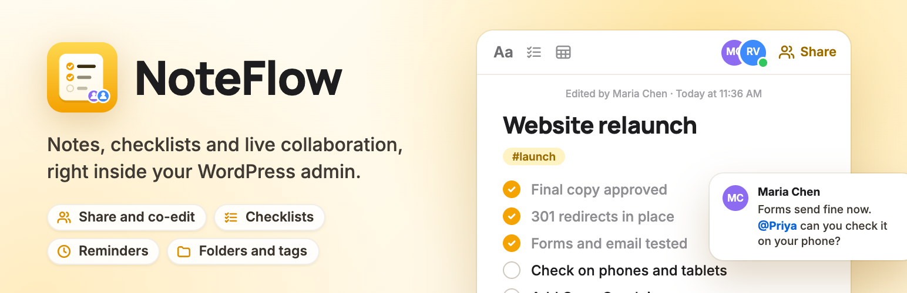
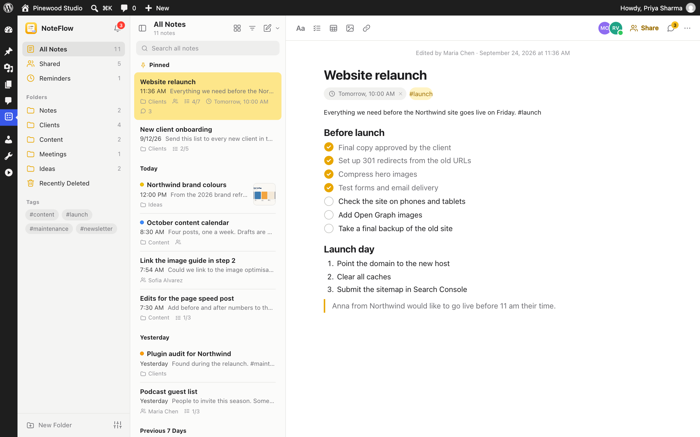

# NoteFlow

[](https://wordpress.org/plugins/noteflow/)
[](https://wordpress.org/plugins/noteflow/)
[](https://wordpress.org/support/plugin/noteflow/reviews/)
[](https://wordpress.org/plugins/noteflow/)
[](https://github.com/wpankit/noteflow/actions/workflows/coding-standards.yml)
[](https://github.com/wpankit/noteflow/actions/workflows/plugin-check.yml)
[](LICENSE)



A notes app in your WordPress admin with checklists, reminders and shared notes, plus comments and issues on posts and pages for your team. Everything is saved as you type and stays in your own WordPress database.

**[Get it on WordPress.org](https://wordpress.org/plugins/noteflow/)** · [Support forum](https://wordpress.org/support/plugin/noteflow/)



## Features

- **Notes that feel like your computer's notes app:** folders, tags, pins, search, checklists, rich text, `[[` links to posts and notes, autosave, and light and dark appearance.
- **Work together:** share notes as viewers or editors, see who else is there, and edit at the same time. Changes to different paragraphs merge; NoteFlow never silently overwrites anyone's work. Each note has version history, comments and @mentions.
- **Discussions on posts and pages:** comment on any block, raise issues and assign them, and @mention people, in the block editor and the classic editor. A column in the posts list shows what's open.
- **Modules you can switch off:** Dashboard widget, quick capture, toolbar notifications, reminders, discussions, content notes, templates, and import and export.
- **Private by default:** notes belong to the person who wrote them until they share them, and NoteFlow makes no requests to outside services.

Everything in NoteFlow is free, and what's free stays free.

## Requirements

- WordPress 6.0 or later
- PHP 7.4 or later

## Development

Clone the repository into a WordPress site's plugins folder as `noteflow`, and install the coding standards tools:

```bash
cd wp-content/plugins
git clone https://github.com/wpankit/noteflow.git
cd noteflow
composer install
```

There is no build step: the JavaScript and CSS in `assets/` are loaded as they are.

| Command | What it does |
|---|---|
| `composer lint` | Checks the code against the WordPress Coding Standards and PHP 7.4+ compatibility, using `phpcs.xml.dist`. |
| `composer format` | Fixes the issues that can be fixed automatically. |

### Project layout

| Path | Contents |
|---|---|
| `noteflow-notes.php` | Plugin header, constants and bootstrap |
| `includes/` | Access rules, the REST API (`noteflow/v1`), notes, comments, notifications, settings and upgrades |
| `includes/modules/` | The modules that can be switched off under **NoteFlow → Settings** |
| `assets/` | The notes app, the editor and discussions scripts, and their styles |
| `languages/` | The translation template |
| `.wordpress-org/` | Icon, banners and screenshots for the WordPress.org listing |
| `tools/wporg-assets/` | The script and demo workspace that build those images |

Development files are marked `export-ignore` in `.gitattributes`, so they never reach the plugin zip.

### Checks on every pull request

- **Coding Standards:** PHPCS with the WordPress Coding Standards and PHPCompatibilityWP.
- **PHP Lint:** every PHP file must parse on PHP 7.4 through 8.5.
- **Plugin Check:** the official WordPress.org Plugin Check, run on the plugin as it ships.

## Releasing

For maintainers:

1. In a pull request, set the new version in the plugin header, in `NOTEFLOW_VERSION` and in the `Stable tag` of `readme.txt`, and add the changelog entry.
2. Merge it, then [publish a release](https://github.com/wpankit/noteflow/releases/new) from `main` with the tag `vX.Y.Z`.
3. The **Deploy to WordPress.org** workflow checks the three version numbers match the tag, commits `trunk` and `tags/X.Y.Z` to SVN, updates the listing assets and attaches the plugin zip to the release.

To publish readme or screenshot changes without a release, run the **Update readme and assets on WordPress.org** workflow by hand. Both workflows need the repository secrets `SVN_USERNAME` and `SVN_PASSWORD`.

## Contributing

Bug reports, ideas and pull requests are welcome. Please read [CONTRIBUTING.md](CONTRIBUTING.md) first; everyone taking part follows the [Code of Conduct](CODE_OF_CONDUCT.md).

## Security

Please report security issues privately, as described in [SECURITY.md](SECURITY.md).

## License

[GPL-2.0-or-later](LICENSE). Made by [WPAnkit](https://wpankit.com/).
